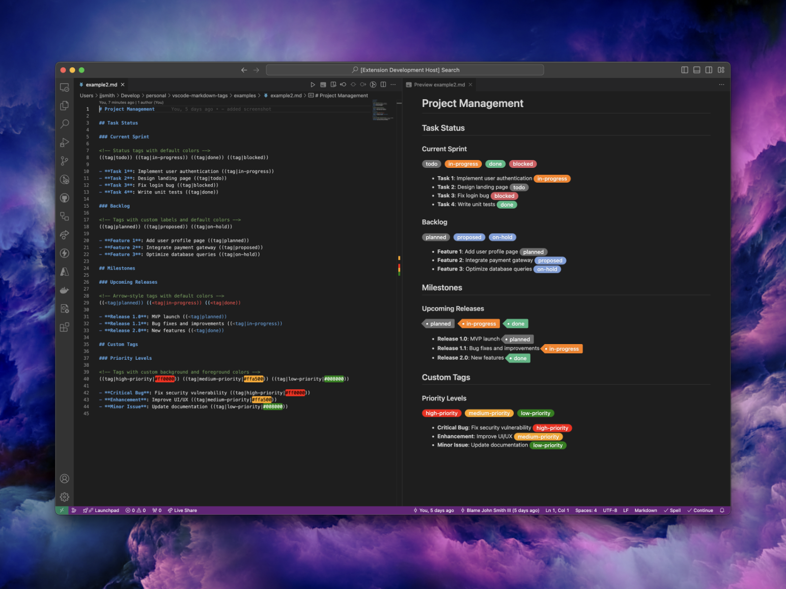

# Tags for Markdown: Enhanced Tag Styling for VS Code

Add visual flair to your Markdown documents with custom tag styles! **Tags for Markdown** lets you highlight and style labels within Markdown documents using simple syntax, customizable colors, and optional arrow indicators—all in the native Visual Studio Code preview. If you like **Tags for Markdown**, get our plugin for [Obsidian](https://github.com/binarynoir/obsidian-markdown-tags)!

[](https://buymeacoffee.com/binarynoir)
[](https://ko-fi.com/binarynoir)
[](https://binarynoir.tech)



## Features

### 🎨 Styled Tags

### 🖌️ Customizable Colors

Use predefined colors or specify custom hex codes for both background and foreground colors, enabling unlimited styling options.

### 📄 Flexible Syntax

Simple, flexible syntax options:

```markdown
((tag|label))
((tag|label|background-color))
((tag|label|background-color|foreground-color))
((<tag|label)) <!-- Adds an arrow to the left -->
```

### 🌈 Supports a Variety of Colors

Choose from predefined colors (`grey`, `green`, `orange`, etc.) or use custom hex codes to suit your design preferences.

---

## Getting Started

1. **Install the Extension**:

   - **From Visual Studio Code**:

     1. Open Visual Studio Code.
     2. Go to the Extensions view by clicking on the Extensions icon in the Activity Bar on the side of the window or by pressing `Ctrl+Shift+X` (Windows/Linux) or `Cmd+Shift+X` (macOS).
     3. Search for `Markdown Tags`.
     4. Click on the `Install` button.

   - **From the Visual Studio Code Marketplace**:
     1. Visit [Markdown Tags on Visual Studio Code Marketplace](https://marketplace.visualstudio.com/items?itemName=BinaryNoir.vscode-markdown-tags).
     2. Click on the `Install` button.
     3. Follow the prompts to complete the installation in Visual Studio Code.

2. **Add Tags** in your Markdown files using the syntax below.
3. **Open Preview** (Right-click the Markdown file → "Open Preview" or `Ctrl+Shift+V` on Windows or `Cmd+Shift+V` on macOS) to view styled tags in action.

### Basic Syntax Examples

#### Status Tags

```markdown
((tag|todo)) ((tag|in-progress|#ffcc00)) ((tag|done|#28a745|#ffffff))
```

#### Arrowed Tags

```markdown
((<tag|planned)) ((<tag|custom test))
```

#### Customizing Colors

```markdown
((tag|background|#ff4500)) ((tag|foreground||#ff6347)) ((tag|both colors|#32cd32|#ffffff))
```

---

## Tags and Colors

Available supported tags: **todo**, **planned**, **in-progress**, **doing**, **done**, **tip**,
**on-hold**, **tbd**, **proposed**, **draft**, **wip**, **mvp**,
**blocked**, **canceled**, **error**, **warning**, **warn**

For each tag, the following colors are available: **grey**, **green**, **yellow**, **orange**, **blue**, **purple**, **red**.

[See Examples Markdown Documents](/examples/)

### Tag Examples

#### TODO

- `((tag|todo|grey))`
- `((tag|todo|green))`
- `((tag|todo|yellow))`
- `((tag|todo|orange))`
- `((tag|todo|blue))`
- `((tag|todo|purple))`
- `((tag|todo|red))`

#### PLANNED

- `((tag|planned|grey))`
- `((tag|planned|green))`
- `((tag|planned|yellow))`
- `((tag|planned|orange))`
- `((tag|planned|blue))`
- `((tag|planned|purple))`
- `((tag|planned|red))`

#### IN-PROGRESS

- `((tag|in-progress|grey))`
- `((tag|in-progress|green))`
- `((tag|in-progress|yellow))`
- `((tag|in-progress|orange))`
- `((tag|in-progress|blue))`
- `((tag|in-progress|purple))`
- `((tag|in-progress|red))`

#### DOING

- `((tag|doing|grey))`
- `((tag|doing|green))`
- `((tag|doing|yellow))`
- `((tag|doing|orange))`
- `((tag|doing|blue))`
- `((tag|doing|purple))`
- `((tag|doing|red))`

#### DONE

- `((tag|done|grey))`
- `((tag|done|green))`
- `((tag|done|yellow))`
- `((tag|done|orange))`
- `((tag|done|blue))`
- `((tag|done|purple))`
- `((tag|done|red))`

#### TIP

- `((tag|tip|grey))`
- `((tag|tip|green))`
- `((tag|tip|yellow))`
- `((tag|tip|orange))`
- `((tag|tip|blue))`
- `((tag|tip|purple))`
- `((tag|tip|red))`

... _(repeat as necessary for remaining tags: on-hold, tbd, proposed, draft, mvp, etc.)_

---

### With Arrow (using `((<tag|label|bgcolor))`)

#### MVP

- `((<tag|mvp|grey))`
- `((<tag|mvp|green))`
- `((<tag|mvp|yellow))`
- `((<tag|mvp|orange))`
- `((<tag|mvp|blue))`
- `((<tag|mvp|purple))`
- `((<tag|mvp|red))`

... _(repeat as necessary for remaining tags: on-hold, tbd, proposed, draft, mvp, etc.)_

---

## Advanced Options

### CSS Integration

Add custom styles by modifying the `style.css` file in the extension folder to match your preferences.

### Error Handling

The extension defaults to `grey` when invalid colors are detected to ensure a consistent and polished look.

---

## Contributing

Feel free to submit issues, feature requests, or contribute code on [GitHub](https://github.com/binarynoir/markdown-tag).

## License

MIT License

---

## Support

If you encounter any issues or have questions, please open an issue on [GitHub](https://github.com/binarynoir/markdown-tag/issues).

## Author

John Smith III

## Acknowledgments

Thanks to all contributors and users for their support and feedback.
